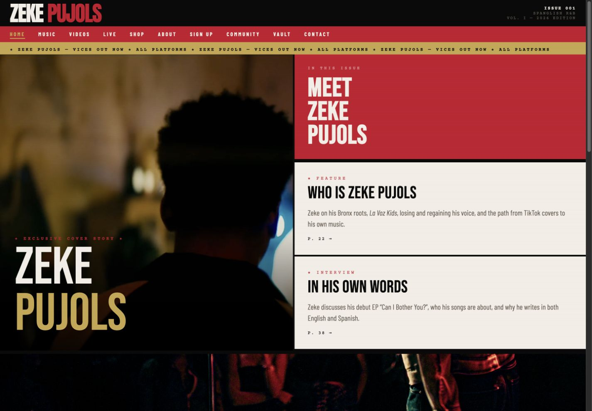
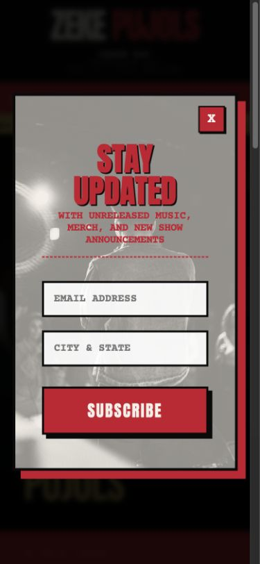
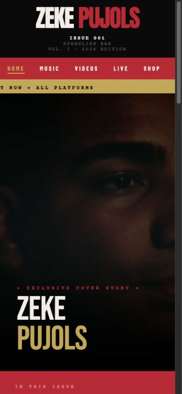
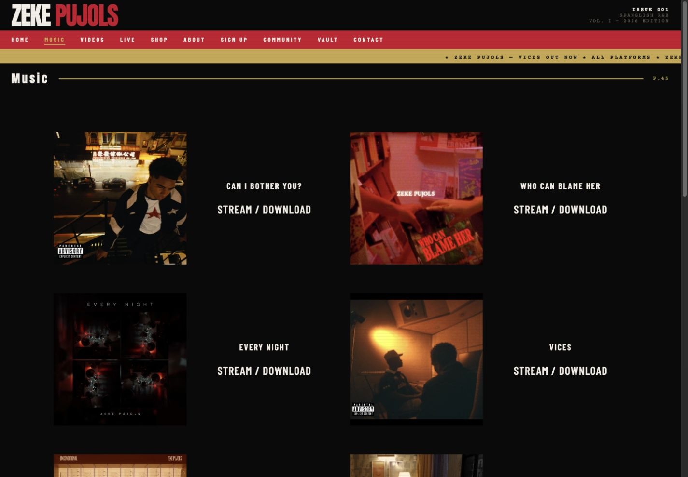
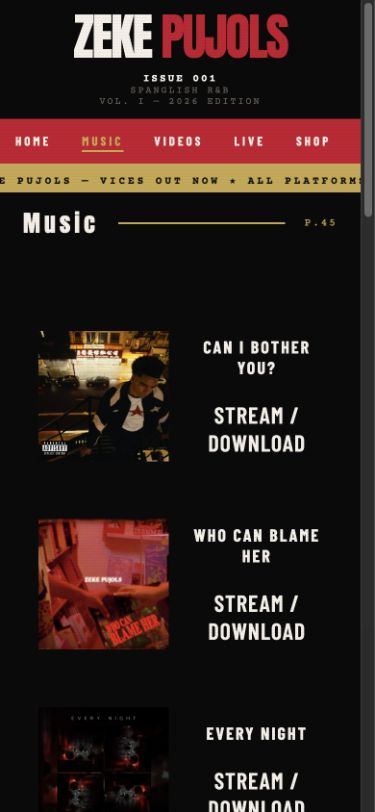
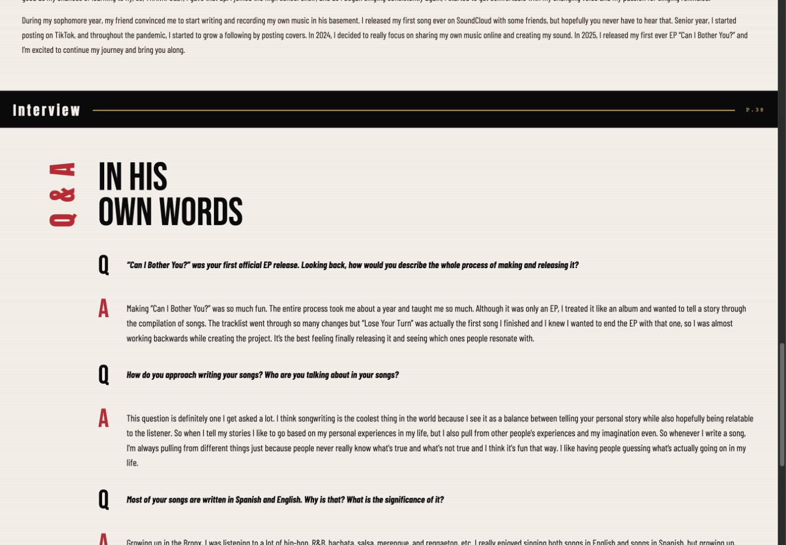
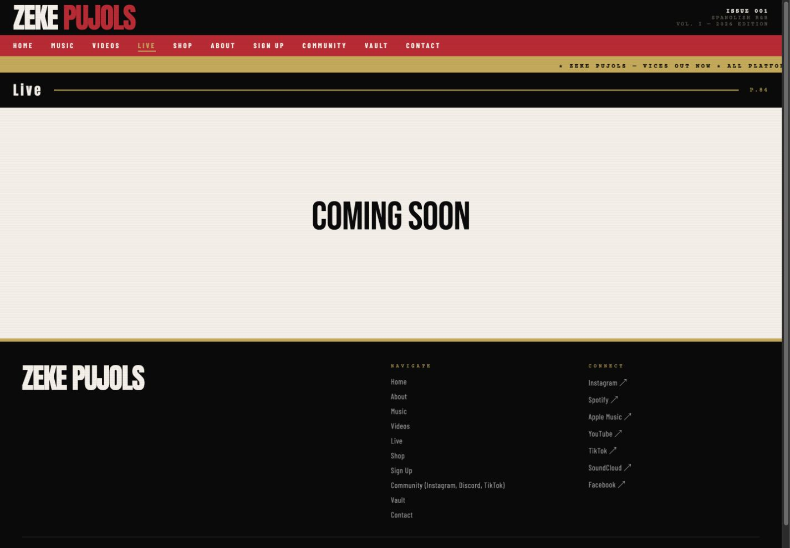
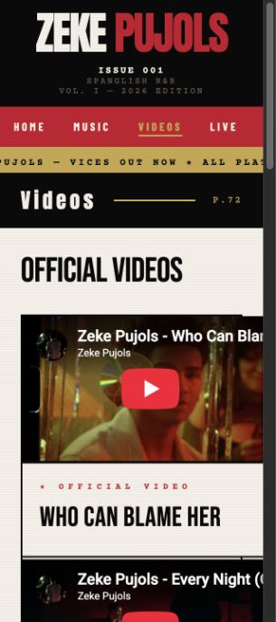

# Zeke Pujols Website Audit

Date: July 22, 2026  
Scope: Design, responsive behavior, animation/motion, accessibility risks, technical performance, and SEO.  
Evidence: Local site at 1440×1000, 390×844, and 320×720; Home, Music, About, Live, and Videos were visually reviewed. All ten HTML pages, shared CSS/JavaScript, and the production build were inspected.

## Overall verdict

The site has a memorable identity: it feels like a music magazine rather than a generic artist template. The black, cream, red, and gold palette; condensed display typography; grain; and editorial page-number language all work together.

The biggest gap is between art direction and product execution. Desktop is visually confident, but first-visit interruption, mobile navigation, cramped responsive layouts, inaccessible interactions, heavy media, and a missing SEO foundation reduce reach and usability. The best next version should keep the visual language and simplify the mechanics around it.

## Audit flow

### 1. Homepage first impression — Mixed

Strengths:

- The split hero has a strong cover-story composition and immediately establishes the artist.
- The palette, typography, image treatment, ticker, and issue metadata feel cohesive.
- The release and artist story are both discoverable from the first screen.

Risks:

- The two story cards are clickable `div` elements rather than links, so keyboard users and crawlers do not receive the same affordance.
- The homepage has no H1. The visible artist name is generic text.
- The primary conversion goal is unclear: the page competes among biography, interview, music, and signup without one dominant next action.
- Tiny, letter-spaced navigation and issue metadata trade readability for style.

### 2. Signup interruption — Poor

The modal appears after one second and blocks the page before the visitor has engaged. It has no dialog role, accessible name relationship, focus entry/trap/restoration, Escape behavior, or background inerting. Focus remains on the document body, the page can still scroll behind it, and the fields rely on placeholders rather than labels.

Recommendation: use a tested `<dialog>` pattern, ask after meaningful engagement or exit intent, add persistent labels and an `aria-live` result, support Escape/backdrop dismissal, and preserve a non-modal signup section in the page. A first-visit mobile interstitial this aggressive can also hurt organic search experience.

### 3. Mobile homepage and navigation — At risk

The hero retains the brand, but the ten-item navigation becomes a hidden-scroll row with no cue that more destinations exist. Only the first few links are visible, and later active routes can start offscreen. The large masthead consumes substantial vertical space before content.

Recommendation: use a compact mobile menu, or make the horizontal row deliberately scrollable with an overflow fade/arrow, larger touch targets, active-item auto-scroll, and `aria-current="page"`.

### 4. Music catalog — Strong desktop, cramped mobile

Desktop has a clear, repeatable release rhythm with confident spacing. On mobile, each release remains a two-column image/details card, forcing titles and the repeated `STREAM / DOWNLOAD` label into awkward wraps. Cover art is implemented as CSS background imagery inside empty links, which removes useful alt text and image-search semantics.

Recommendation: stack image, title, metadata, and CTA below roughly 480–560px; make each release title a heading; use `<picture>/` with dimensions, responsive sources, descriptive alt text, and lazy loading; add release date/type and platform-specific options.

### 5. About and interview reading experience — Mixed

The editorial concept and authentic photography are excellent. The primary About heading is also the rare correct H1 in the site. However, 16px condensed body copy stretches almost the full viewport, making long-form reading tiring.

Recommendation: keep condensed type for display and metadata, use a normal-width body face at 17–18px, cap prose around 65–75 characters, and create a consistent vertical rhythm between paragraphs, imagery, and Q&A blocks.

### 6. Live placeholder — Poor

`Coming Soon` leaves a large empty surface with no user value, conversion, or search relevance. Merch has the same thin-content problem.

Recommendation: add a location-aware show-alert signup, archive of past performances, live photo/video, booking/contact path, and a short explanation of what visitors can expect. Until substantive content exists, consider `noindex` for Live and Merch rather than asking search engines to index near-empty pages.

### 7. Videos at 320px — At risk

At 320px, the document is wider than the viewport and the global `overflow-x: hidden` masks the crop. The embedded YouTube titles are visibly cut off. Five direct embeds also create avoidable third-party load.

Recommendation: change the grid minimum to `minmax(min(100%, 18rem), 1fr)`, reduce mobile padding, and activate the click-to-load video facade already present in `js/main.js`. Give every video a specific iframe title, visible description/date, thumbnail, direct watch link, and `VideoObject` structured data.

## Highest-impact improvements

### Priority 0 — Fix broken and blocking fundamentals

1. Restore the corrupted hero poster and parallax assets. `image_2.jpeg`, `parallax-1.png`, and `parallax-2.png` are not valid image binaries. The parallax JavaScript currently runs without usable texture imagery. Twenty-two image files in the asset folder are invalid data and should be restored from originals or removed if unused.
2. Replace the one-second signup overlay with an accessible, lower-friction dialog or delayed inline conversion.
3. Make story cards, release artwork, and Vault hotspots semantic, named links with keyboard and touch support.
4. Fix narrow responsive layouts: mobile navigation, music cards, video grid, footer text, and touch targets.

### Priority 1 — Establish a coherent motion system

The current page can run an autoplaying 14.4-second hero video, a 28-second infinite ticker, page-entry fades, scroll parallax, hover scaling, fixed backgrounds, filters, and blend modes at the same time. There is no reduced-motion branch or pause control.

Recommended motion grammar:

- Let the hero video be the one dominant ambient motion.
- Add a visible pause control for video/ticker and pause motion when offscreen or the tab is hidden.
- Under `prefers-reduced-motion: reduce`, use the static poster, stop ticker/parallax/reveals, and disable fixed backgrounds.
- Trigger optional section reveals on viewport entry rather than page load; keep them around 350–450ms with 8–12px travel.
- Use 120–180ms explicit transitions for nav underline, buttons, and cards; avoid `transition: all`.
- Remove permanent `will-change` from the two 120vw × 200vh parallax layers.
- Match hover, focus-visible, and active states so keyboard and touch users receive equivalent feedback.

### Priority 1 — Build the SEO foundation

1. Add one descriptive H1 to the eight pages currently missing one.
2. Replace the repeated `The official site of Zeke Pujols.` description with page-specific copy and improve titles around useful intent such as Spanglish R&B artist, music, official videos, and tour dates.
3. Add absolute canonical URLs, Open Graph and Twitter Card metadata, a favicon, `robots.txt`, and a canonical-only `sitemap.xml`.
4. Add JSON-LD: `Person` + `WebSite` on Home/About, `MusicAlbum`/`MusicRecording` on Music, `VideoObject` on Videos, and `MusicEvent` when shows exist.
5. Convert music artwork from CSS backgrounds to semantic responsive images.
6. Give videos unique headings, iframe titles, descriptions, upload dates, thumbnails, transcripts/lyrics where appropriate, and direct links.
7. If the production site is deployed from `dist`, ensure `CNAME`, robots, sitemap, icons, and share images live in a copied public/static directory; the current Vite build does not place the root `CNAME` in `dist`.

### Priority 1 — Reduce media cost

- The homepage attempts roughly 7.6 MiB of local media: a 4.86 MB hero MP4 plus a 2.05 MB fixed-background image and the release cover.
- Remove the muted MP4's unnecessary audio track, create mobile and desktop encodes, restore and prioritize a lightweight poster, and defer video playback until after initial paint.
- Resize images near their rendered dimensions and ship AVIF/WebP with `srcset`/`sizes`.
- Add intrinsic dimensions and lazy loading to below-fold images. The 3000×3000 release art is displayed around 400×400; several About/Vault images are 1.8–2.5 MB.
- Replace direct YouTube iframes with click-to-load thumbnails.
- Move Google Fonts out of CSS `@import`, reduce the eleven requested variants, and self-host/subset WOFF2 if practical.

### Priority 2 — Systematize the design

- Expand the existing color variables into type, spacing, border, shadow, and motion tokens.
- Extract shared masthead, navigation, footer, card, button, form, and page-header styles instead of repeating inline styles and mouse handlers.
- Replace brittle responsive selectors such as `[style*="padding: 48px"]` with real component classes.
- Increase small metadata to 12–14px. Gold on red is about 2.57:1, muted text on black about 3.23:1, and the footer copyright about 2.13:1; these do not meet normal-text contrast targets.

## What is already working

- The visual identity is unusually distinctive and appropriate for the artist.
- The static HTML is crawlable without hydration, internal navigation is comprehensive, and the production JS/CSS bundles are small.
- The site already includes skip links and a visible global focus treatment.
- Major desktop grids intentionally stack at tablet widths, images generally use useful crops, and most external links use `rel="noopener"`.
- The production build succeeds; its one warning is the missing `assets/images/placeholder.jpg` reference.

## Evidence limits

This is not a full WCAG certification or a Search Console/Core Web Vitals field-data review. Screen-reader output, keyboard traversal on every route, 200%/400% zoom, real-device touch behavior, production analytics, backlink/index coverage, and production network timing still require dedicated testing. The visual findings are based on the screenshots captured in this audit run, and source-code findings were verified against the current workspace.

## Recommended implementation order

1. Restore critical image assets and remove the missing placeholder reference.
2. Rebuild the modal as an accessible, delayed conversion.
3. Fix mobile navigation, music cards, video overflow, and semantic interactions.
4. Add reduced-motion and pause behavior, then simplify the motion stack.
5. Add canonical metadata, unique titles/descriptions, H1s, sitemap/robots, social cards, and structured data.
6. Optimize media and fonts.
7. Refactor repeated inline styling into a small shared design system.
